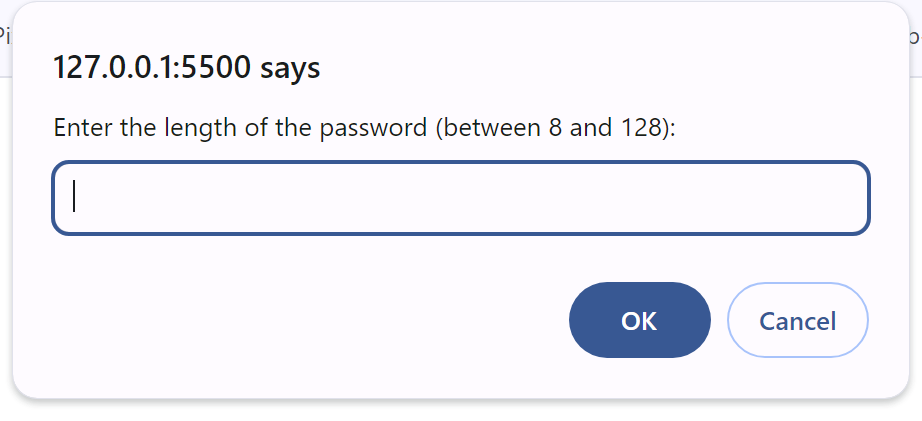

# Password Generator

A simple web-based password generator that allows users to customize the length and character types of their passwords.

## Table of Contents
- [Overview](#overview)
- [Features](#features)
- [Usage and example](#usage)
- [How to Run](#how-to-run)
- [License](#license)

## Overview

This project is a password generator implemented using HTML, CSS, and JavaScript. It prompts the user for password length and character types (lowercase, uppercase, numeric, and special characters) and generates a random password based on the specified criteria.

## Features

- Customizable password length (between 8 and 128 characters).
- Options to include or exclude character types (lowercase, uppercase, numeric, and special characters).
- Random password generation based on user input.

## Usage

To use the password generator:

1. Open the `index.html` file in a web browser.
2. Click the "Generate Password" button.
3. Follow the prompts to specify the password criteria.
4. View the generated password in an alert.

It should look like this: 


## How to Run

To run this project locally, follow these steps:

1. Clone the repository:

   ```bash
   git clone https://github.com/your-username/password-generator.git
